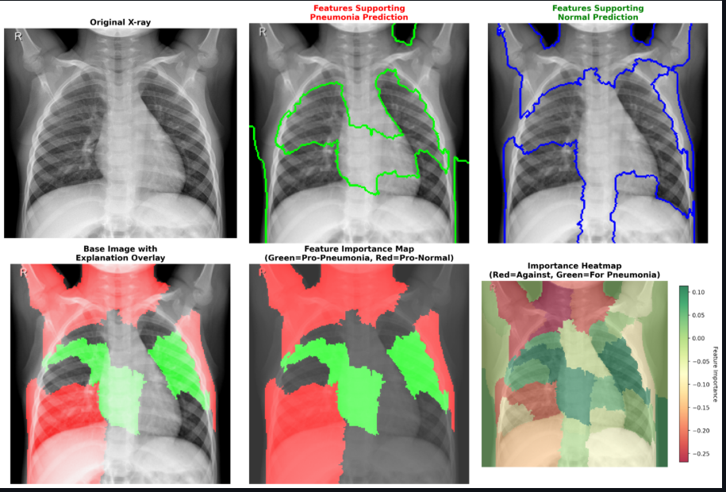
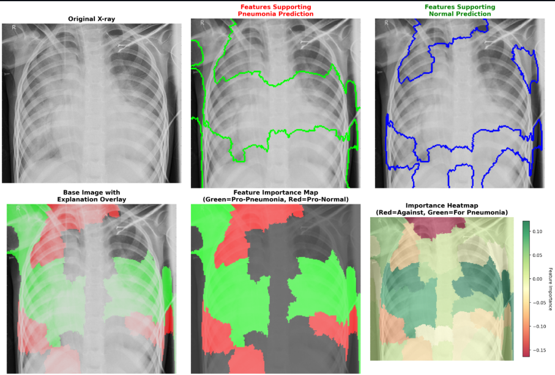

# Pneumonia Detection and Explainability from Chest X-Rays

## Overview

This project is a research-grade AI platform for pneumonia detection from chest X-ray images, integrating advanced preprocessing, multi-modal explainability, and uncertainty quantification. The system uses deep learning to classify chest X-rays as Normal or Pneumonia and generates detailed, interpretable explanations to support clinical decision-making.

## Features

- Enhanced X-ray preprocessing with OpenCV CLAHE for medical image quality improvement.
- Binary classification using a convolutional neural network.
- Explainability via LIME and SHAP visualizations highlighting regions influencing model decisions.
- Natural language clinical-grade explanations using AI language models.
- Uncertainty quantification for confidence-aware predictions.
- Streamlit-based interactive interface for image upload and result visualization.

## Explanation of Sample Images

### 1. Normal Case

This X-ray is a normal case where the AI model mostly detects features supporting normal lung anatomy. The red-colored regions on the explanation overlays correspond to vascular and anatomical markings typical in healthy lungs, especially in the lower lung zones. While the model highlighted some green areas (indicating confusion), the presence of red spots in the required lung regions suggests the model can identify normal features reliably.

### 2. Pneumonia Case

This X-ray shows a patient diagnosed with pneumonia. The explainability maps prominently highlight the central and lower lung regions in green, corresponding to pneumonia-supporting features such as lung infiltrates or consolidations. This clear distinction demonstrates the model's ability to distinguish pathological patterns from normal anatomy visually.

## Getting Started

### Prerequisites

- Python 3.8+
- TensorFlow
- OpenCV
- Streamlit
- LIME and SHAP (optional for explanation)
- Additional dependencies listed in `requirements.txt`

### Installation

git clone https://github.com/ajitha26/X-ray-explainability.git
cd X-ray-explainability
pip install -r requirements.txt

### Usage

Run the Streamlit app:

streamlit run app.py

Upload chest X-ray images and get AI-based analysis with interpretable explanations.

## Future Work

- Extend to multi-class classification for other lung diseases.
- Incorporate federated learning for privacy preservation.
- Improve natural language explanations to include more clinical context.
- Optimize explainability algorithms for faster analysis.

## License

This project is for research and educational use only and is not FDA approved for clinical diagnosis.

## Acknowledgements

Thanks to the Kaggle Chest X-Ray Pneumonia Dataset for providing data for training and evaluation.

---

